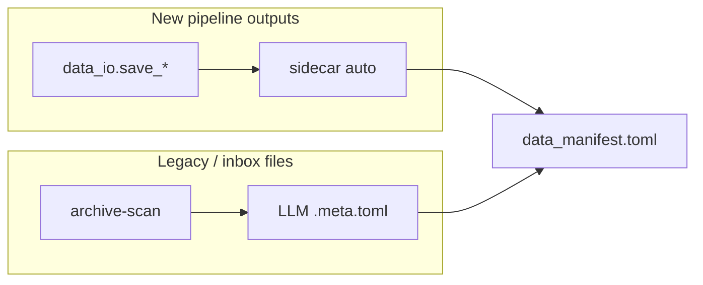

# Project skeleton for new DH repos

**Canonical template repo:** [dighum_template](../)

**Start here:** [NEW_REPO.md](NEW_REPO.md) — step-by-step guide for bootstrapping and customizing a new repo.

## Quick start

```bash
cd ~/develop/dighum_template
./scripts/bootstrap.sh ~/develop/MyNewProject my-new-project
cd ~/develop/MyNewProject
uv sync
# Edit data_manifest.toml — tier roots + [datasets.*]
uv run python -m data_io.check
git init && git add . && git commit -m "Bootstrap DH data manifest project"
```

Optional legacy inventory (`llm_archivist`):

```bash
./scripts/bootstrap.sh ~/develop/MyNewProject my-new-project --with-archivist
# requires llm-archivist sibling repo; override with LLM_ARCHIVIST_SRC=...
```

## What gets copied

| Source | Destination in new repo |
|--------|-------------------------|
| `template/*` (excl. `optional/`, `shared/`, `.venv/`) | AGENTS.md, PLAN.md, plans/, README.md, docs, pyproject.toml, notebooks/, output/, `.vscode/`, `.cursor/rules/`, `.github/copilot-instructions.md` |
| `packages/data_io/` | `data_io/` |
| `template/optional/archivist/` + `llm-archivist` | `llm_archivist/`, inbox scripts (only with `--with-archivist`) |
| `tests/test_data_io.py` | `tests/` |

`data_io` is always copied so each project is self-contained (SURF, offline). `llm_archivist` is opt-in — most new pipelines only need `data_io`.

## Two-tool provenance model



| Tool | When | LLM? |
|------|------|------|
| **`data_io`** | All new writes | No — deterministic provenance |
| **`llm_archivist`** | Orphan files in `output/_inbox/`, migrated legacy | Optional — `archive-inventory` (fast) or `archive-scan` (LLM) |

## LLM coding workflow

1. **`AGENTS.md`** — path rules, `data_io` writes, when to `archive-scan` (canonical for Cursor **and** VS Code Copilot)
2. **`.cursor/rules/project-standards.mdc`** — always-apply Cursor rules (same body as Copilot instructions)
3. **`.github/copilot-instructions.md`** — VS Code Copilot (same body; do not maintain separately)
4. **`docs/DATA.md`** — tiers, phases, both tools
5. **`PLAN.md`** — headlines (goal, checklist, data-path table); `plans/` holds milestones and steps
6. **`.vscode/settings.json`** — interpreter, pytest, Jupyter, excludes (both editors)
7. **`<package>.code-workspace`** — folder + extension recommendations only

## Living project state

Each bootstrapped project includes a compact status system for humans and AI agents:

| File | Purpose |
|------|---------|
| `docs/state.json` | Machine-readable source of truth for task status, focus, metrics, blockers, and next actions |
| `docs/STATE.md` | Rendered dashboard with a Mermaid overview and short state summary |
| `docs/DECISIONS.md` | Durable decision log for methodological and architectural choices |
| `00_project_dashboard.ipynb` | Lightweight visual dashboard for status and result inspection |
| `tasks/_template_task/00_task_overview.ipynb` | Copyable per-task overview notebook |

Use the SvZ CLI from the project root:

```bash
uv run python scripts/svz.py status
uv run python scripts/svz.py update S1 inprogress --title "Diagnostics"
uv run python scripts/svz.py metric S1 containment_mean 0.295 --label "Mean entity containment"
uv run python scripts/svz.py decision "Boundary tolerance" --context "..." --decision "..." --reason "..."
uv run python scripts/svz.py render
uv run python scripts/svz.py doctor
```

Keep heavy processing in reproducible scripts. Let notebooks read outputs and render tables/plots;
let `docs/state.json` and `docs/STATE.md` carry only the short current state needed to restart work.

Optional layers (see [addons/README.md](../addons/README.md), [wisdom/INDEX.md](../wisdom/INDEX.md)):

- **`--with-wisdom`** — portable topics → `docs/wisdom/`
- **`--with-archivist`** — legacy file inventory package
- **`--addon <name>`** — domain overlay (`rpp`, `trifecta`, …)

### Prompt pattern

```
Read AGENTS.md and PLAN.md.
Add [datasets.my_output] to data_manifest.toml.
Implement scripts/extract.py using save_semi_structured.
Run uv run python -m data_io.check when done.
```

### Document an inbox folder

```
Run archive-inventory on output/_inbox (no Ollama).
Read INVENTORY.md at the scan root; register canonical files in data_manifest.toml.
Optional: archive-scan for LLM-rich sidecars.
```

### Validation

```bash
uv run python -m data_io.check
uv run pytest tests/ -q
```

## Syncing updates

Use **`sync_project.sh`** from dighum_template — see [SYNC-PROJECT.md](SYNC-PROJECT.md).

```bash
cd ~/develop/dighum_template
./scripts/sync_project.sh ~/develop/MyNewProject --dry-run --all
./scripts/sync_project.sh ~/develop/MyNewProject --all
```

Or sync pieces only:

```bash
./scripts/sync_project.sh ~/develop/MyNewProject --data-io --wisdom
./scripts/sync_project.sh ~/develop/MyNewProject --state
# archivist (manual for now):
rsync -a ~/develop/llm-archivist/src/llm_archivist/ ~/develop/MyNewProject/llm_archivist/
```

For the state feature only, the convenience wrapper is equivalent to `sync_project.sh --state --editor-rules`:

```bash
./scripts/update_project.sh ~/develop/MyExistingProject --dry-run
./scripts/update_project.sh ~/develop/MyExistingProject
```

## Maintaining dighum_template

`data_io` is developed in `republic_ner_matching`. Refresh the vendored copy:

```bash
cd ~/develop/dighum_template
./scripts/sync_data_io.sh
```
