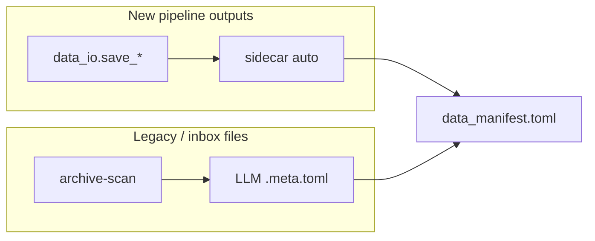

# Project skeleton for new DH repos

**Canonical template repo:** [dighum_template](../)

**Start here:** [NEW_REPO.md](NEW_REPO.md) — step-by-step guide for bootstrapping and customizing a new repo.

**Prerequisite:** clone [llm-archivist](../../llm-archivist) as a sibling repo (`~/develop/llm-archivist`).

## Quick start

```bash
cd ~/develop/dighum_template
./scripts/bootstrap.sh ~/develop/MyNewProject my-new-project
cd ~/develop/MyNewProject
uv sync
# Edit data_manifest.toml — tier roots + [datasets.*]
uv run python -m data_io.check
git init && git add . && git commit -m "Bootstrap DH data manifest project"
```

Override archivist source if needed:

```bash
LLM_ARCHIVIST_SRC=~/develop/llm-archivist/src/llm_archivist ./scripts/bootstrap.sh ...
```

## What gets copied

| Source | Destination in new repo |
|--------|-------------------------|
| `template/*` | AGENTS.md, PLAN.md, docs, pyproject.toml, `.cursorrules`, `.cursor/rules/`, `.vscode/`, `<package>.code-workspace`, scripts |
| `packages/data_io/` | `data_io/` |
| `../llm-archivist/src/llm_archivist/` | `llm_archivist/` |
| `tests/test_data_io.py` | `tests/` |
| `../llm-archivist/tests/test_scanners.py` | `tests/test_llm_archivist.py` |
| `../llm-archivist/tests/test_inventory.py` | `tests/test_inventory.py` |

Both packages are copied at bootstrap time so each project is self-contained (SURF, offline).

## Two-tool provenance model



| Tool | When | LLM? |
|------|------|------|
| **`data_io`** | All new writes | No — deterministic provenance |
| **`llm_archivist`** | Orphan files in `_inbox/`, migrated legacy | Optional — `archive-inventory` (fast) or `archive-scan` (LLM) |

## LLM coding workflow

1. **`AGENTS.md`** — path rules, `data_io` writes, when to `archive-scan`
2. **`.cursor/rules/project-standards.mdc`** — uv, manifest, pandas conventions (always apply)
3. **`.cursorrules`** — short manifest discipline (legacy auto-load)
4. **`docs/DATA.md`** — tiers, phases, both tools
5. **`PLAN.md`** — status + data-path table
6. **`<package>.code-workspace`** — editor profile (interpreter, lint, test, excludes)

Optional layers (see [addons/README.md](../addons/README.md), [wisdom/INDEX.md](../wisdom/INDEX.md)):

- **`--with-wisdom`** — portable topics → `docs/wisdom/`
- **`--addon <name>`** — domain overlay (`rpp`, `trifecta`, …)

### Prompt pattern

```
Read AGENTS.md and PLAN.md.
Add [datasets.my_output] to data_manifest.toml.
Implement scripts/extract.py using save_semi_structured.
Run uv run python -m data_io.check when done.
```

### Document an inbox folder

```
Run archive-inventory on scratch/_inbox (no Ollama).
Read INVENTORY.md at the scan root; register canonical files in data_manifest.toml.
Optional: archive-scan for LLM-rich sidecars.
```

### Validation

```bash
uv run python -m data_io.check
uv run pytest tests/ -q
```

## Syncing updates

```bash
rsync -a ~/develop/dighum_template/packages/data_io/ ~/develop/MyNewProject/data_io/
rsync -a ~/develop/llm-archivist/src/llm_archivist/ ~/develop/MyNewProject/llm_archivist/
```

## Maintaining dighum_template

`data_io` is developed in `republic_ner_matching`. Refresh the vendored copy:

```bash
cd ~/develop/dighum_template
./scripts/sync_data_io.sh
```
